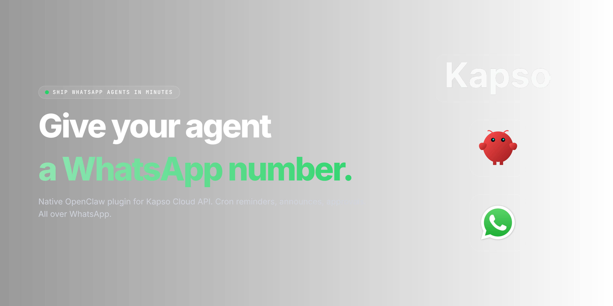

<p align="center">
  
</p>

# openclaw-whatsapp-kapso

**Native OpenClaw channel plugin for WhatsApp (Kapso).**

[](https://www.npmjs.com/package/openclaw-whatsapp-kapso)
[](https://www.npmjs.com/package/openclaw-whatsapp-kapso)
[](https://github.com/TomasWard1/openclaw-whatsapp-kapso/actions/workflows/ci.yml)
[](./LICENSE)
[](#requirements)
[](https://github.com/openclaw)

Connect WhatsApp Business (via [Kapso](https://kapso.ai) — a managed wrapper around Meta's WhatsApp Cloud API) to your [OpenClaw](https://github.com/openclaw) agent. Drop-in: runs in-process, registers in OpenClaw's channel registry, unlocks the full ecosystem — cron reminders, announces, approvals, sessions, bindings — over WhatsApp.

## What this is

A first-class, in-process OpenClaw channel plugin. When you install it, OpenClaw treats WhatsApp exactly like Telegram or VK: the agent can proactively message users, reply to inbound messages, schedule crons that deliver over WhatsApp, and honor approval gates — all with the same configuration surface and runtime hooks as every other channel.

## Why this over `Enriquefft/openclaw-kapso-whatsapp`?

Both projects target the same goal (WhatsApp via Kapso for OpenClaw) but take fundamentally different architectures. Neither is wrong — they solve different problems. Here's the breakdown so you can pick the right one:

| Aspect | **openclaw-whatsapp-kapso** (this repo) | `Enriquefft/openclaw-kapso-whatsapp` |
| --- | --- | --- |
| Language | TypeScript | Go |
| Integration mode | **Native in-process plugin** via `@openclaw/plugin-sdk` | External process bridging over OpenClaw's WebSocket gateway + tailing JSONL |
| Runs | Inside the OpenClaw Node.js runtime | As a separate Go daemon next to OpenClaw |
| Outbound triggers | Cron, announce, approvals, sessions, bindings — all work out of the box | Only in reaction to inbound WS events; cron/announce require ecosystem-level integration |
| Channel registry | Registered in OpenClaw's channel registry like any other channel | Not registered — bridges messages in/out externally |
| Install | `openclaw plugins install openclaw-whatsapp-kapso` | Clone, `go build`, run separately |
| Setup | Interactive wizard via `openclaw channels add` | Manual config + process supervisor |

**TL;DR:** if you're all-in on OpenClaw and want WhatsApp to behave like any other OpenClaw channel — pick this. If you want a stand-alone Go service you can operate independently — the other project is a fine choice.

## Features

- [x] Text messages (chunked at Meta's 4096-char limit)
- [x] Media outbound: image, audio, document, video, sticker (URL-based)
- [x] Reply-to / quoted messages (`context.message_id`)
- [x] Inbound webhook parser for v2 payloads (single + batched)
- [x] HMAC-SHA256 signature verification over raw body (constant-time compare)
- [x] Idempotency dedupe (bounded LRU, configurable cap)
- [x] Drops outbound echoes and `origin: business_app` messages automatically
- [x] Audio transcript support (Kapso server-side transcription via `message.kapso.transcript.text`)
- [x] Multi-account (default + named sub-accounts)
- [x] Sandbox + production via same host (different `phone_number_id`)
- [x] Cron / announce / approval-aware — matches OpenClaw's capability contract

## Related X/Twitter workflows

Keep this plugin focused on WhatsApp Business chats, inbound webhooks, media, cron reminders, announces, approvals, sessions, and OpenClaw channel delivery. If the same OpenClaw workspace also needs public X/Twitter data or visible X/Twitter actions, install TweetClaw as a separate plugin:

```bash
openclaw plugins install @xquik/tweetclaw
```

[TweetClaw](https://github.com/Xquik-dev/tweetclaw) covers tweet scraper workflows such as scrape tweets, search tweets, search tweet replies, follower export, user lookup, media upload, media download, direct messages, monitor tweets, webhooks, giveaway draws, and approval-gated post tweets or post tweet replies. Use the TweetClaw GitHub repo and [npm package](https://www.npmjs.com/package/@xquik/tweetclaw) for setup details; the [ClawHub discovery page](https://clawhub.ai/plugins/@xquik/tweetclaw) remains useful for browsing while that listing lags behind npm. Keep WhatsApp and X/Twitter credentials separate, and review visible X/Twitter actions through OpenClaw approval flows.

## Quick start

<!-- TODO: setup wizard GIF -->

```bash
# 1. Install the plugin
openclaw plugins install openclaw-whatsapp-kapso

# 2. Add a WhatsApp-Kapso channel (launches the interactive wizard)
openclaw channels add --channel whatsapp-kapso

# 3. Paste the printed webhook URL into Kapso dashboard → WhatsApp → Webhooks
```

The wizard collects:
- **Kapso project API key** (Dashboard → Project Settings → API Keys)
- **WhatsApp `phone_number_id`** (digits-only Meta ID, e.g. `647015955153740`)
- **Webhook shared secret** (generate a random 32+ char string — Kapso uses it to HMAC-sign each webhook)
- **API base URL** (optional — defaults to `https://api.kapso.ai`)

## Configuring the Kapso webhook

In the Kapso dashboard, register a **Kapso-native** webhook for your phone number:

| Field | Value |
| --- | --- |
| URL | The webhook URL printed by the wizard (e.g. `https://<your-agent-host>/webhooks/whatsapp-kapso/default`) |
| Events | `whatsapp.message.received` |
| Secret key | The same shared secret you entered in the wizard |

Kapso will sign every delivery with `X-Webhook-Signature` (HMAC-SHA256 hex over the raw body) and this plugin verifies that signature in constant time before processing. Unsigned or invalid deliveries are rejected with `401`.

## Requirements

- Node.js `>=20`
- An OpenClaw host that supports the `@openclaw/plugin-sdk` plugin contract
- A Kapso account with a provisioned WhatsApp phone number

## Configuration reference

The plugin reads its configuration from the OpenClaw config file under `channels.whatsapp-kapso`:

```jsonc
{
  "channels": {
    "whatsapp-kapso": {
      "apiKey": "kp_live_xxxxxxxxxxxx",
      "phoneNumberId": "647015955153740",
      "webhookSecret": "this-is-thirty-two-chars-fine!!!",
      "apiBaseUrl": "https://api.kapso.ai"
    }
  }
}
```

Multi-account (default + named):

```jsonc
{
  "channels": {
    "whatsapp-kapso": {
      "apiKey": "kp_default_xxx",
      "phoneNumberId": "647015955153740",
      "webhookSecret": "default-secret-thirty-two-chars!",
      "accounts": {
        "sandbox": {
          "apiKey": "kp_sandbox_xxx",
          "phoneNumberId": "12345678901234567",
          "webhookSecret": "sandbox-secret-thirty-two-chars!"
        }
      }
    }
  }
}
```

<!-- TODO: reminder-via-whatsapp demo GIF -->

## Development

```bash
git clone https://github.com/TomasWard1/openclaw-whatsapp-kapso
cd openclaw-whatsapp-kapso
npm install
npm test           # full unit suite (node --test + tsx)
npm run test:watch # TDD loop
npm run check:pack # validate what would ship to npm
```

TDD is the default workflow: new behavior lands as a failing test first, then implementation. The `test/` directory mirrors `src/` one-to-one — adding a new module means adding its `.test.ts` next to it.

## Release

CalVer — `YYYY.M.N`. To publish a release:

1. Bump `version` in `package.json` on `staging` (or let the release workflow compute the bump from conventional commits).
2. Open the promote PR (`staging` → `main`). Merge.
3. The `publish.yml` workflow validates tag == package.json version, runs tests, packs, and publishes to npm with OIDC provenance.

See `BLOCKERS.md` for the one-time npm Trusted Publisher setup that the first publish needs.

## License

MIT © 2026 Tomas Ward — see [LICENSE](./LICENSE).

## Credits

- Structural inspiration: [`pfrankov/openclaw-vk`](https://github.com/pfrankov/openclaw-vk) — the reference third-party OpenClaw channel plugin.
- API surface: [Kapso](https://kapso.ai) and their [docs](https://docs.kapso.ai).
- For a different architectural approach (Go external bridge), see [`Enriquefft/openclaw-kapso-whatsapp`](https://github.com/Enriquefft/openclaw-kapso-whatsapp).
